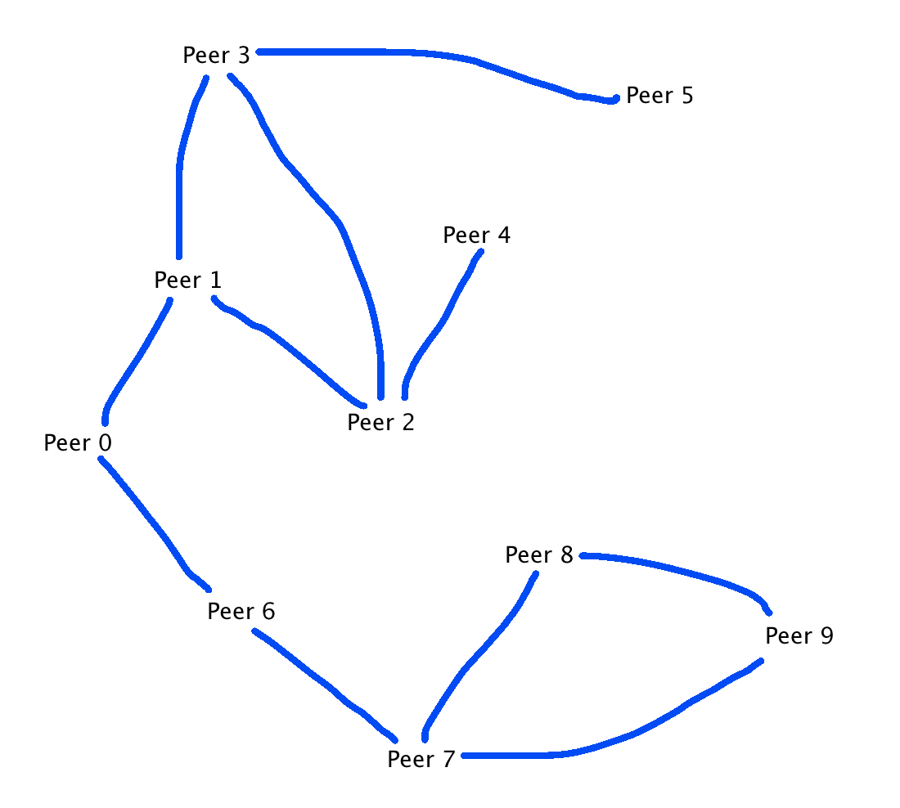

# Version 2 of the Flooding Task
This task is similar to the last, but we don't have a fully connected network
Sample output:
```
Peer <0> Messages Seen = <3>
Peer <6> Messages Seen = <2>
Peer <1> Messages Seen = <3>
Peer <4> Messages Seen = <1>
Peer <5> Messages Seen = <1>
Peer <2> Messages Seen = <3>
Peer <7> Messages Seen = <3>
Peer <3> Messages Seen = <3>
Peer <8> Messages Seen = <2>
Peer <9> Messages Seen = <2>
```
This is a *multi-hop* network because Peer 0 sends messages to a subset of peers, which then send out further `:hello` messages until the entire network has sent out `:hello` messages to its peers.

The sample output matches our expectations - it indicates that each Peer has exactly as many peers as we set there to be, with exception of Peer 0, which has one additional message from the Flooding server.
## Diagram
There are indeed 6 hops between Peer 4 and Peer 8
